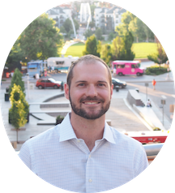

Shortly after graduating college, I started my own insurance agency, Applegate Consulting. After growing my practice for 7 years, I was ready for a new challenge. I've always enjoyed problem solving and building things. These two interests led me to coding.

In 2017, I got my first taste of programming. I took a part-time class with the Data Science program at Galvanize in Denver. I knew I was getting into something that could challenge me. I really enjoyed the challenge and the culture at Galvanize. I decided this was my next career! I enrolled in the Web Development Immersive Program through Galvanize in June of 2018. The 6 month program takes you from the basics to full stack web development. I fought hard to gain as much knowledge as I could about Javascript, React.js, Node.js, and other technologies. I completed the infamous capstone project, where you are challeged to incorporate multiple new technologies into a full stack application, generate a demo, and deliver a presentation within a week. After graduation I realized though that my journey into software development had only just begun.

I'm currently working on a React, Redux full stack application to get more comfortable with the Redux flow. Please contact me if you have any interest in my projects. Check out my blog for more on my latest projects!

When I'm not coding, I'm outside enjoying the beautiful mountains. I enjoy hiking, fly-fishing, camping, and skiing. I'm a member of social clubs for travel, learning Spanish, and computer programming. I'm a believer in meditation and living a healthy lifestyle.

This blog was built using a GatsbyJS starter template.

### Standard features:

* Easy editable content in **Markdown** files (posts, pages and parts)
* **SEO** (sitemap generation, robot.txt, meta and OpenGraph Tags)
* **Social** sharing (Twitter, Facebook, Google, LinkedIn)
* **Comments** (Facebook)
* **Images** lazy loading and `webp` support (gatsby-image)
* Post **categories** (post list filtering)
* Full text **searching** (Algolia)
* **Contact** form (Netlify form handling)
* **RSS** feed
* **PWA** (manifest.json, offline support, favicons)
* Google **Analytics**
* **Favicons** generator (node script)
* **Material UI** (@next)

### Advanced features:

* Easy customizable base **styles** via `theme` object (fonts, colors, sizes)
* **Components** lazy loading (social sharing, comments)
* **ESLint** (google config)
* **Prettier** code styling
* Custom webpack `CommonsChunkPlugin` settings
* Webpack `BundleAnalyzerPlugin`
* Contact **form validation** (react-material-ui-form-validator)

MIT License

Copyright (c) 2017 gatsbyjs\
Copyright (c) 2018 greg lobinski

Permission is hereby granted, free of charge, to any person obtaining a copy of this software and associated documentation files (the "Software"), to deal in the Software without restriction, including without limitation the rights to use, copy, modify, merge, publish, distribute, sublicense, and/or sell copies of the Software, and to permit persons to whom the Software is furnished to do so, subject to the following conditions:

The above copyright notice and this permission notice shall be included in all copies or substantial portions of the Software.

THE SOFTWARE IS PROVIDED "AS IS", WITHOUT WARRANTY OF ANY KIND, EXPRESS OR IMPLIED, INCLUDING BUT NOT LIMITED TO THE WARRANTIES OF MERCHANTABILITY, FITNESS FOR A PARTICULAR PURPOSE AND NONINFRINGEMENT. IN NO EVENT SHALL THE AUTHORS OR COPYRIGHT HOLDERS BE LIABLE FOR ANY CLAIM, DAMAGES OR OTHER LIABILITY, WHETHER IN AN ACTION OF CONTRACT, TORT OR OTHERWISE, ARISING FROM, OUT OF OR IN CONNECTION WITH THE SOFTWARE OR THE USE OR OTHER DEALINGS IN THE SOFTWARE.