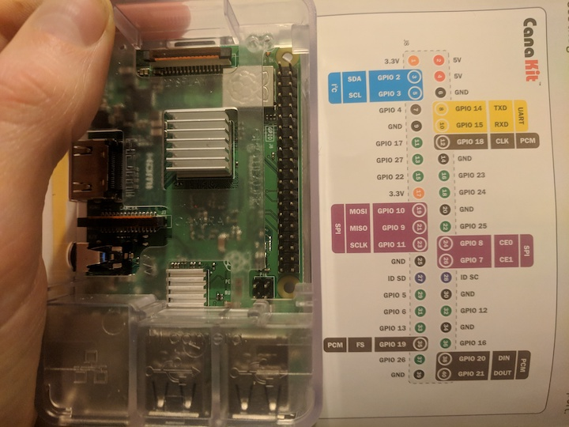
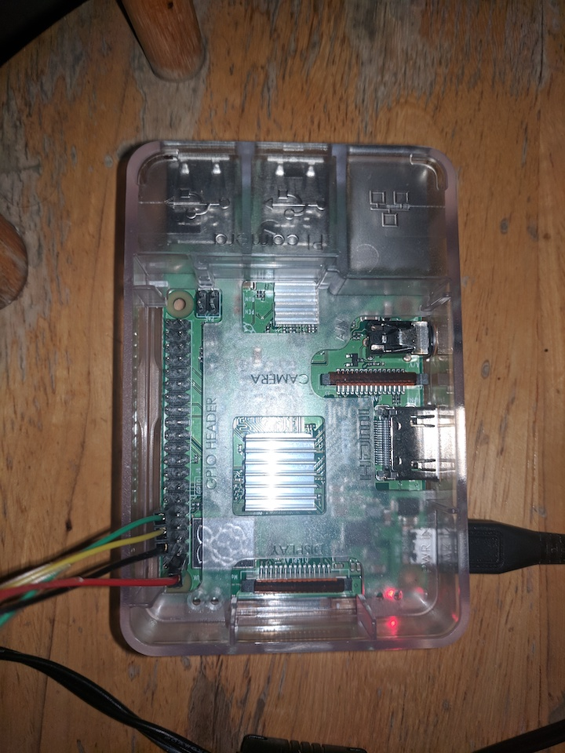
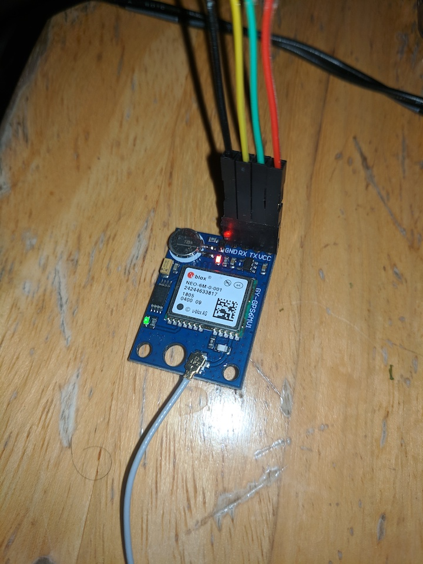
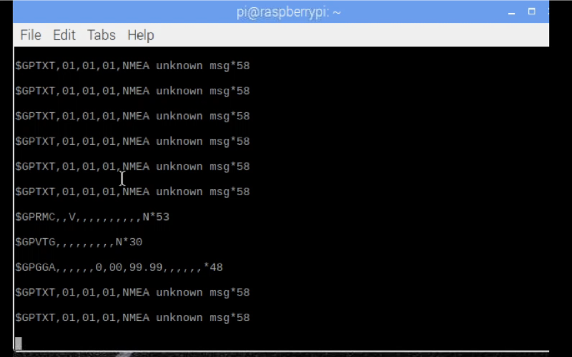
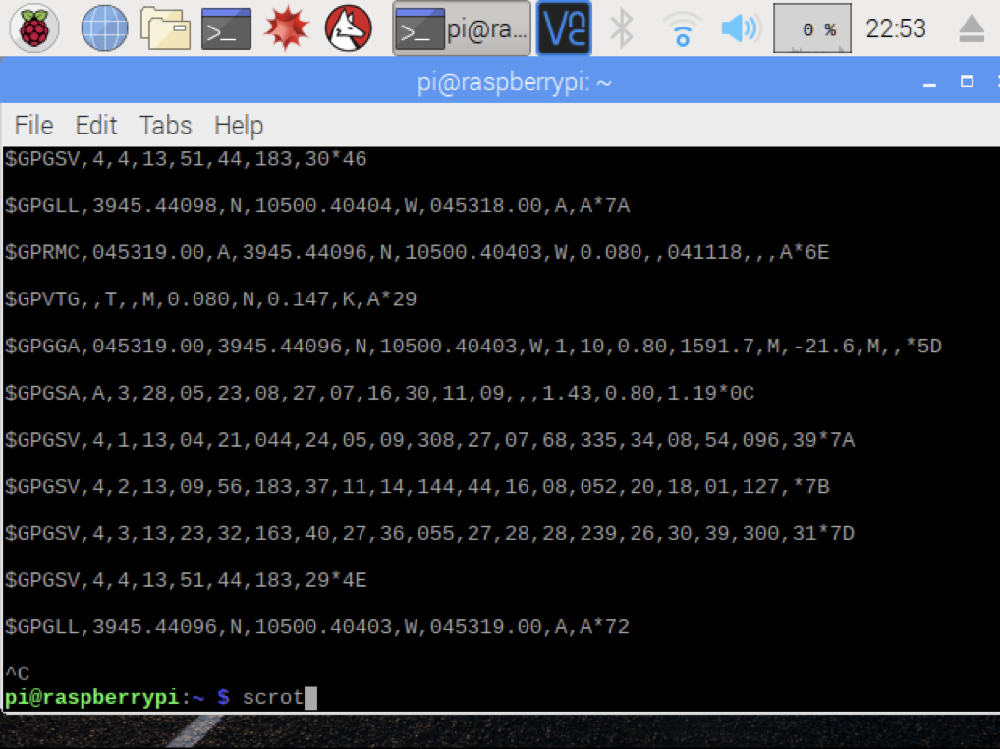

<h1 id="3" style="font-weight: bold">Step 3 - Connect GPS</h1>

***


Verify the cmdline.txt file.
```
cat /boot/cmdline.txt
```
There should be no console=serial0

The serial0 is the serial port we need to use for the GPS.

Now we need to modify the /boot/config.txt to enable UART and disable the bluetooth.
```
nano /boot/config.txt
```
Paste the following into the bottom:
```
dtoverlay=pi3-disable-bt
core_freq=250
enable_uart=1
force_turbo=1
```
Ctrl+X to exit, press Y to save
```
sudo reboot
```

The final step is enable the getty service for ttyAMA0 or serial0. I'm not sure the reason why this must be done. I want my script to be the only thing accessing the port, but without enabling the getty my script doesn't work.

Connect the device using pins.



**VCC to Pin 1, which is 3.3v**

**TX to Pin 10, which is RX (GPIO15)**

**RX to Pin 8, which is TX (GPIO14)**

**Gnd to Pin 6, which is Gnd**





The red light on the GPS lights up when receiving power, and the green light blinks when receiving a satellite signal.

Console log the stream of data.
```
sudo cat /dev/serial0
```
If nothing happens, press control + C to exit.

Enable the getty-service.
```
sudo systemctl enable serial-getty@ttyAMA0.service
```
Cat either port.
```
sudo cat /dev/ttyAMA0
```
If you get back a response like the picture below, your GPS cannot get a fix. Try placing the Pi next to a window or on a porch.



You want to get a response like the one below.



Hooray! You are getting good data. What is it?

The console is logging NMEA sentences. What are those?

They all return different data, but we only need either the GPGGA or the GPRMC to get the latitude and the longitude. If we wanted the velocity and directional data, we would use the GPRMC.

<a href="https://www.youtube.com/watch?v=AXwSYz6htsg&index=24&list=LLUS9Tv-pcbyrIL0noeS5Jmg&t=0s" target="_blank">More on NMEA sentences</a>

We'll run a script to parse the data.
