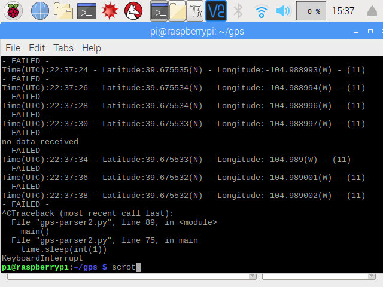
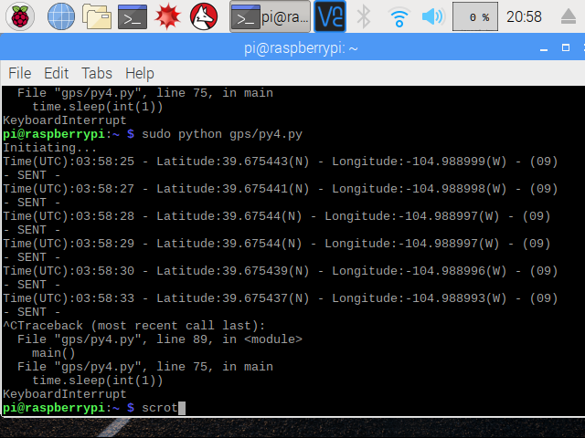

<h1 id="4" style="font-weight: bold">Step 4 - Parse Data</h1>

***


Let's Git set up!

Enter username.
```
git config --global user.name "YOUR_USERNAME"
git config --global user.name
```
Enter email.
```
git config --global user.email "email@example.com"
git config --global user.email
```
Verify setup.
```
git config --global --list
```
Create directory.
```
mkdir gps
cd gps
touch gps-parser.py
nano gps-parser.py
```
Copy and paste script below into gps-parser.py file.
```python
def decode(coord):
    v = coord.split(".")
    head = v[0]
    tail =  v[1]
    deg = head[0:-2]
    min = head[-2:]
    totalmin = min + "." + tail
    percentdeg = round((float(totalmin) / 60), 6)
    degnum = float(deg)
    totaldeg = degnum + percentdeg
    totaldegstr = str(totaldeg)
    return totaldegstr

def getLoc():

    port = "/dev/serial0"
    ser = serial.Serial(port, baudrate = 9600, timeout=1)
    location = 0

    while location == 0:
        try:
            data = ser.readline()
        except:
            print "no data received"
            return
        for line in data.split('\n'):
            if line.startswith( '$GPGGA' ):
                location = 1
                s = line.split(",")
                if (len(s) < 7):
                    print "no satellite data available"
                    return
                if (s[7] == '0') or (s[7] == ""):
                    print "no satellite data available"
                    return
                time = s[1][0:2] + ":" + s[1][2:4] + ":" + s[1][4:6]
                lat = decode(s[2])
                dirLat = s[3]
                global negLat
                negLat = lat
                if dirLat == "S":
                    negLat = "-" + lat
                lon = decode(s[4])
                dirLon = s[5]
                global negLon
                negLon = lon
                if dirLon == "W":
                    negLon = "-" + lon
                sat = s[7]
                try:
                    print "Time(UTC):%s - Latitude:%s(%s) - Longitude:%s(%s) - (%s)" %(time, negLat, dirLat, negLon, dirLon, sat)
                    return
                except:
                    print "no lat or long"
                    return

def main():

    name = ""
    key = ""

    print 'Initiating...'

    baseURL = 'https://api.thingspeak.com/update?api_key=%s' % key

    while True:
        time.sleep(int(1))
        getLoc()
        try:
            f = urllib2.urlopen(baseURL +
                                    "&field1=%s&field2=%s&field3=%s" % (name, negLat, negLon))
            print "- SENT -"
            f.close()
        except:
            print "- FAILED TO SEND -"


#Call main
if __name__ == '__main__':
    main()
```
Run the script.
```
python gps-parser.py
```
Terminal should log the following.



If you get a script error, it might be due to indentation.

If you get no satelite data received, there might be another operation running on the port.

Grep the port.
```
ps aux | grep serial0
```
Or.
```
ps -ef | grep serial0
```
Grab the operation id (the first number in line) from the operation you wish to stop, and insert in place of id-number below to stop the action.
```
sudo kill id-number
```

###**Script Logic** 

We created an infinite loop using while True because we want the script to run forever. We made the function getLoc() to run another infinite loop to keep checking the serial port for valid data. We created two separate loops for more control over the timing. We added a buffer using time.sleep() before calling getLoc(). If data is being received by ser.readline(), we'll scan the line starting with GPGGA for the latitude and longitude. If there are coordinates, we'll send them to decode(). We'll log the result to the console along with the number of satellites pinged. And finally we'll send the new coordinates to our server and log the result.

You are missing the api key and name for your api call. Go to <a href="https://thingspeak.com/" target="_blank">ThingSpeak</a>, a free api that stores data in JSON, to create a profile. Follow the instructions and create a channel. Add your name and api key in the script, and the coordinates will send to your channel.

Run the script, and the terminal should log the following.




You can access the data stored in ThingSpeak from anywhere. Or you could write your own script using another language, request library, database, api, or server. The only limiting factor is Wifi, but Pi's can connect to a cellular network! Future blog post?

Create remote, add, commit, push.
```
git init
git add .
git commit '1st parser'
git remote add origin https://github.com/user/repo.git
git push origin master
```
Run script.
```
sudo python gps-parser.py
```
You return should look like below.


HIGH FIVE! You've accomplished the impossible!


An easier way to write code is with IDE through the Pi's GUI or using a Web IDE. To access the Pi's GUI, use VNC Viewer. 

###**VNC Viewer**

With VNC you can cloud connect to view the Pi's GUI from any network without messing with IP addresses.

- Download in Pi terminal.
```
sudo apt-get update
sudo apt-get install realvnc-vnc-server realvnc-vnc-viewer
```

-   <a href="https://www.realvnc.com/raspberrypi/#sign-up" target="_blank">Sign up for a RealVNC account</a>. RealVNC's cloud service is free for educational or non-commercial purposes.

-   On Pi, sign in to VNC Server using your new RealVNC account credentials.

-   Download RealVNC app on computer or phone. <a href="https://www.realvnc.com/download/viewer/" target="_blank">Download RealVNC app</a>.

-   Sign in to VNC Viewer using the same RealVNC account credentials.

###**IDE's**

- <a href="https://realpython.com/python-thonny/Thonny" target="_blank">Thonny</a>, a Python IDE, comes already installed on RaspbianOS. Viewing the Pi's GUI, you can run Thonny from terminal with the following command.
```
thonny
```

- <a href="https://learn.adafruit.com/webide/overview" target="_blank">ADAfruit's Web IDE</a> runs headless in any Chrome or Firefox browser connected to the same network, and provides dark theme with sytnax highlighting for Python, Ruby, and Javascritpt.


- <a href="https://www.raspberrypi.org/blog/mu-python-ide/" target="_blank">Mu</a>, a Python IDE released in 2018, looks cool! 

- VS Code and Atom have 3rd party builds for Pi. 

- <a href="https://www.geany.org/" target="_blank">Geany</a> supports tons of programming languages like C, C++, C#, Java, HTML, PHP, Python, Perl, Ruby, Erlang and even LaTeX. 

**Stay tuned for Part II which will cover building the mobile application!**

**Happy Coding!**
